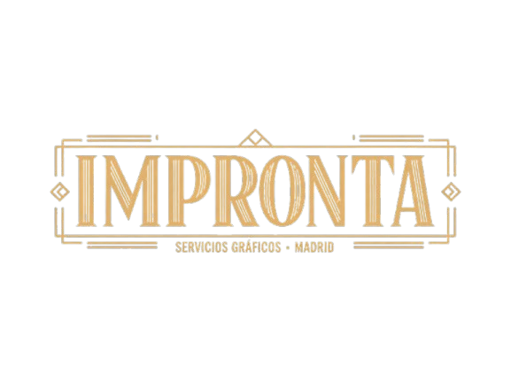

<div align="center">

  
  <br><br>

  <a href="https://ivanchux.github.io/impronta/">
    
  </a>
  &nbsp;
  
  &nbsp;
  

  <br><br>

  
  
  
  
  

</div>

---

## 📋 Descripción

Proyecto de prácticas FCT del **Grado Superior ASIR (Telemática)** en CDMFp, curso 2025–2026.

Consiste en el diseño y desarrollo completo de una **web corporativa ficticia** para una empresa de servicios gráficos e imprenta en Madrid: **Impronta Servicios Gráficos SL**.

> **Alumno:** Iván Brihuega Crespo &nbsp;·&nbsp; **Módulo:** 0373 Lenguajes de Marcas

---

## 🎨 Identidad visual

<div align="center">

| Color | HEX | Uso |
|:-----:|:---:|:----|
|  | `#111d33` | Fondo nav · secciones oscuras |
|  | `#1B2A4A` | Color principal · texto |
|  | `#C9A84C` | Oro · acentos · CTAs |
|  | `#F5F0E8` | Crema · fondo general |

**Tipografías:** `Cormorant Garant` (títulos) &nbsp;+&nbsp; `Jost` (cuerpo y UI) &nbsp;·&nbsp; **Iconos:** Lucide Icons (MIT)

</div>

---

## 🗂️ Páginas

| Página | Descripción |
|--------|-------------|
| [`index.html`](index.html) | Portada — hero con vídeo, servicios, testimonios, CTA |
| [`servicios.html`](servicios.html) | Catálogo completo con acordeón de preguntas frecuentes |
| [`nosotros.html`](nosotros.html) | Historia, valores y equipo |
| [`blog.html`](blog.html) | Listado de artículos del blog |
| [`post-papel.html`](post-papel.html) | Post: Guía completa de papeles de impresión |
| [`post-digital-offset.html`](post-digital-offset.html) | Post: Digital vs Offset — cuándo usar cada técnica |
| [`post-autonomos.html`](post-autonomos.html) | Post: Impresión para autónomos y freelance |
| [`contacto.html`](contacto.html) | Formulario de contacto con validación JS |
| [`presupuesto.html`](presupuesto.html) | Formulario multi-paso (3 pasos) con validación completa |
| [`tarjeta.html`](tarjeta.html) | Generador de tarjetas de visita — descarga PNG anverso + reverso |
| [`404.html`](404.html) | Página de error personalizada |
| [`Legal/aviso-legal.html`](Legal/aviso-legal.html) | Aviso legal — LSSI art. 10 |
| [`Legal/privacidad.html`](Legal/privacidad.html) | Política de privacidad — RGPD / LOPDGDD |
| [`Legal/cookies.html`](Legal/cookies.html) | Política de cookies — AEPD |

---

## ⚡ Funcionalidades

- 🌙 **Modo oscuro** — toggle con persistencia en `localStorage`
- 📱 **Responsive mobile-first** — funciona desde 360 px, menú hamburguesa en móvil
- 📝 **Formularios con validación JS** — contacto y presupuesto multi-paso (3 pasos)
- 🃏 **Generador de tarjetas de visita** — 3 estilos (Clásico / Crema / Dorado), descarga PNG anverso + reverso via `html2canvas`
- 🍪 **Banner de cookies** con consentimiento y persistencia en `localStorage`
- 🔍 **SEO on-page** — `title` único, `meta description`, Open Graph, `sitemap.xml`, `robots.txt`
- ♿ **Accesibilidad WCAG 2.2 AA** — contraste, foco visible, etiquetas en formularios, `alt` descriptivos

---

## 🛠️ Tecnologías

```
Sin frameworks · Sin build · Sin dependencias npm
```

| Capa | Tecnología | Notas |
|------|-----------|-------|
| Maquetación | HTML5 semántico | `header`, `nav`, `main`, `section`, `article`, `footer` |
| Estilos | CSS puro | Variables CSS, Flexbox, Grid, `@media` queries |
| Comportamiento | JavaScript vanilla | ES5 compatible, sin transpilación |
| Fuentes | Google Fonts | Cormorant Garant + Jost (`display=swap`) |
| Iconos | Lucide Icons 0.429 | CDN, licencia MIT |
| Tarjetas | html2canvas 1.4.1 | Captura DOM → PNG descargable |
| Despliegue | GitHub Pages | HTTPS automático, sin coste, sin build |

---

## 🚀 Uso local

```bash
# Clonar
git clone https://github.com/Ivanchux/impronta.git
cd impronta

# Servir localmente (elige una opción)
python -m http.server 8000       # Python 3
npx serve .                      # Node.js
# o simplemente abrir index.html en el navegador
```

---

## 📁 Estructura

```
impronta/
├── 📄 index.html
├── 📄 servicios.html / nosotros.html / blog.html / contacto.html
├── 📄 presupuesto.html / tarjeta.html / 404.html
├── 📄 post-papel.html / post-digital-offset.html / post-autonomos.html
├── 📁 Legal/
│   ├── aviso-legal.html · privacidad.html · cookies.html
├── 📁 Imagenes/          ← fotografías generadas con Ideogram
├── 📁 Videos/            ← vídeo hero (mp4)
├── 🎨 estilos.css        ← variables · reset · componentes · responsive · dark mode
├── ⚙️  scripts.js        ← menú · dark mode · formularios · cookies · generador tarjeta
├── 🗺️  sitemap.xml
└── 🤖 robots.txt
```

---

## 📦 Despliegue

El proyecto se despliega en **GitHub Pages** sin ningún proceso de build:

1. `git push origin main`
2. **Settings → Pages → Branch: `main` → Save**
3. La URL queda disponible en [`https://ivanchux.github.io/impronta/`](https://ivanchux.github.io/impronta/) en menos de 1 minuto

> HTTPS automático · CDN global · Dominio gratuito · Sin cuenta de pago

---

## 📜 Licencias y créditos

| Recurso | Origen | Licencia |
|---------|--------|----------|
| Imágenes | Generadas con [Ideogram](https://ideogram.ai) | Uso libre (proyecto educativo) |
| Iconos | [Lucide Icons](https://lucide.dev) | MIT |
| Tipografías | [Google Fonts](https://fonts.google.com) | SIL Open Font |
| Código | Proyecto educativo FCT | Sin licencia comercial |

---

<div align="center">
  <sub>Proyecto educativo · FCT ASIR Telemática · CDMFp Madrid · 2025–2026</sub>
</div>
